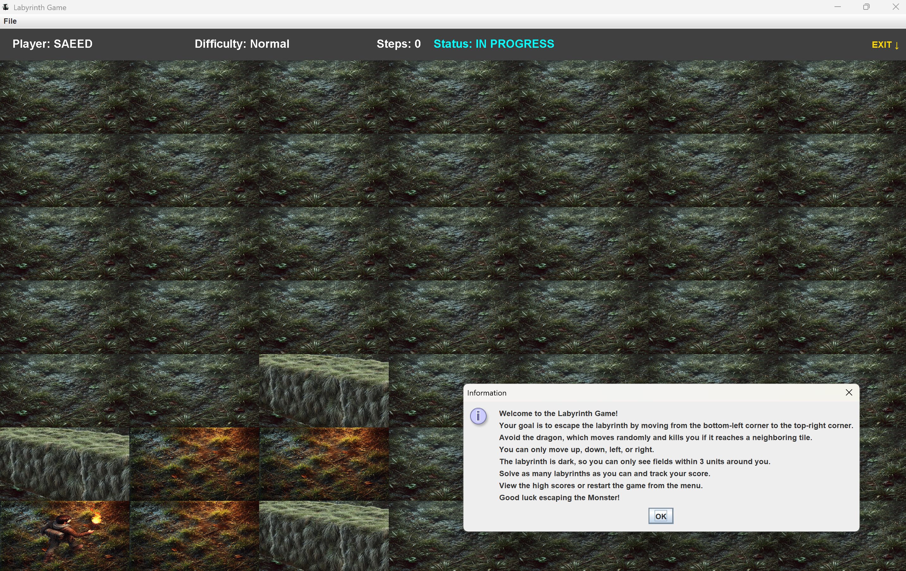
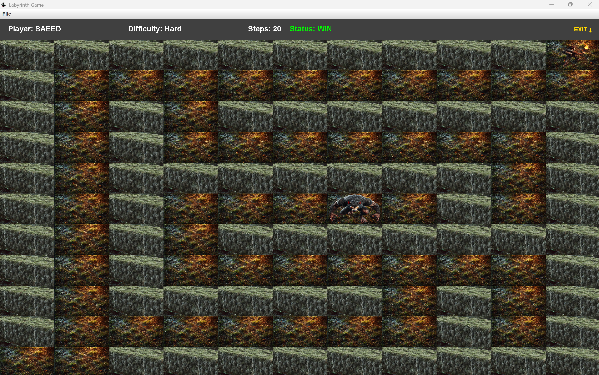
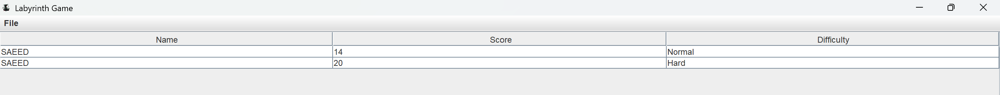

# 🧩 Labyrinth Escape Game – Java Swing Project (Semester 3)

A thrilling strategy puzzle game where you must navigate a procedurally generated labyrinth and **avoid a deadly Monster** — built with **Java Swing**, graph traversal algorithms, and a touch of danger.  
This GUI-based university project was developed for the **Programming Technology course** in **Semester 3** at ELTE.

---

## 📸 Screenshots

### 🕹️ Game Views
- Main Menu  
  

- Start Game (Normal Difficulty) + Help Overlay  
  

- Win on Hard Difficulty  
  

- Lose on Easy  
  

- High Score Table  
  

---

## 🎮 Gameplay Rules

- 🧍 **Start Position**: Bottom-left of the maze  
- 🎯 **Goal**: Reach the top-right corner  
- 🐉 **Monster AI**:  
  - Moves randomly in straight lines  
  - Changes direction when hitting a wall  
  - Kills if it enters a neighboring tile  
- 🔦 **Vision**: Limited to 3-tile radius around player  
- 🕹️ **Controls**: Arrow keys or GUI buttons  
- 🧠 **Scoring**: Increases for each successful escape  
- 💀 **Death**: Score is saved in a local DB when caught

---

## ✨ Features

- 🧠 Procedural maze generation (backtracking with graph theory)  
- 🧊 Limited vision for suspense  
- 🐉 AI Monster movement  
- 💾 Highscore system via **JDBC** and local database  
- 🧪 JUnit unit tests  
- 📚 Javadoc documentation  
- 🪟 Fully interactive Java Swing GUI  
- 📈 View high scores from in-game menu

---

## ⚙️ Tech Stack

- 💻 Java (Swing)
- 🧠 Graph & Backtracking Algorithms
- 🛢️ JDBC (Embedded DB for scores)
- 🧪 JUnit (Testing)
- 📚 Javadoc (Docs)

---

## 🚀 How to Run


Download the latest version from releases.

or

Make sure Maven and Java are installed.

```bash
mvn clean install
java -jar target/LabyrinthGame.jar
```

---

## 🧪 Run Tests

```bash
mvn test
```

---

## 🧾 Project Info

🎓 Student: Saeed Khanloo  
🧠 Course: Programming Technology  
🗓️ Semester: 3  
🪪 License: MIT

---

**Escape the labyrinth… if you can.**
